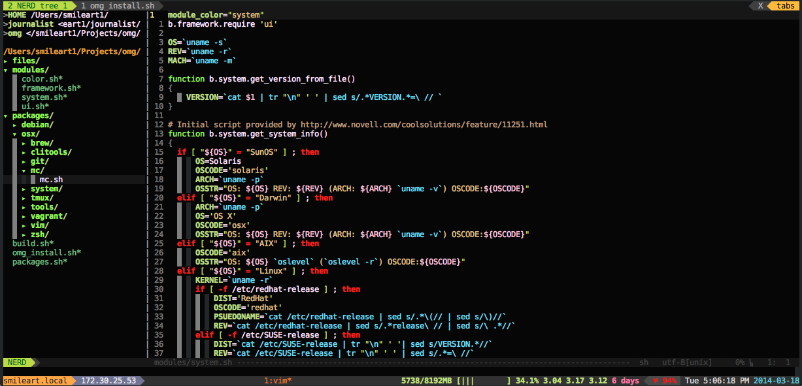
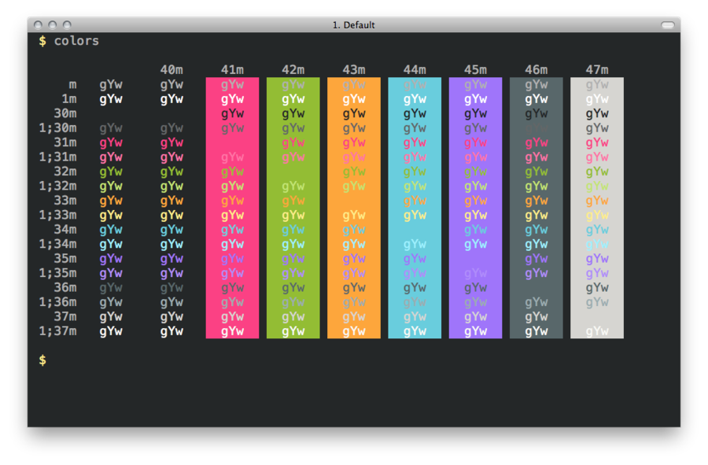
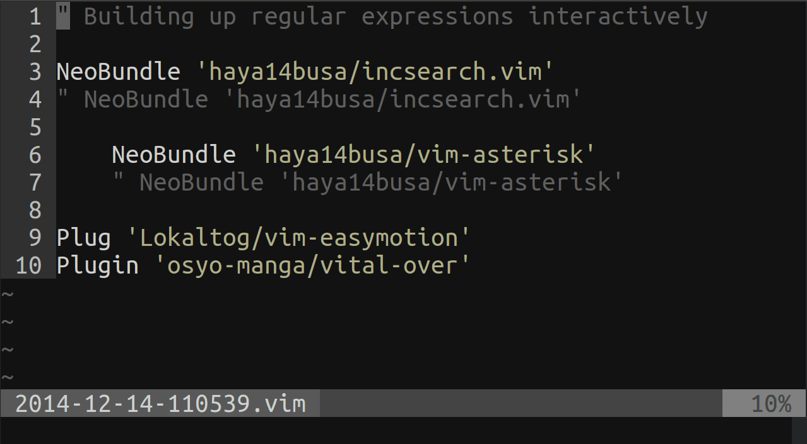

```
       _____           _ _                  _______ _
      / ____|         (_) |         ____   |__   __( )
     | (___  _ __ ___  _| | ___    / __ \ _ __| |  |/ ___
      \___ \| '_ ` _ \| | |/ _ \  / / _` | '__| |    / __|
      ____) | | | | | | | |  __/ | | (_| | |  | |    \__ \
   __|_____/|_| |_|_|_|_|_|\___|  \ \__,_|_|  |_|   _|___/
  / __ \|  \/  |/ ____| | |_   _|  \____/ | |      | | |
 | |  | | \  / | |  __| |   | |  _ __  ___| |_ __ _| | | ___ _ __
 | |  | | |\/| | | |_ | |   | | | '_ \/ __| __/ _` | | |/ _ \ '__|
 | |__| | |  | | |__| |_|  _| |_| | | \__ \ || (_| | | |  __/ |
  \____/|_|  |_|\_____(_) |_____|_| |_|___/\__\__,_|_|_|\___|_|
    * One More Gear v.0.0.2

```

WARNING!
===============
Before using any of those scripts, make sure you have read its code and agree with every action it's going to do with your system!

This set of scripts is distributed in the hope of being useful, but is provided AS IS with ABSOLUTELY NO WARRANTY!


What
===============








Why
===============
Just one more handcrafted gear to follow DRY principle and stop doing things again and again.


(๏ 。๏) <( OMG! )

How
===============

Prerequirements:

** Before usage on a freshly installed MacOS you have to install XCode from the Appstore! **

Some common ways of packages installation:

```
./install packages.sh # install ALL basic packages

./install package_name # install one package
./install package_name --force # install the package even if it's already exists (overwrite .files)
./install package_name package2_name # install a couple of packages
./update # to update oh-my-zsh, vim bundles, brew, ruby gems, npm…
```

How to override .vimrc

```
# just run vim like that (or create alias in ~/.user.aliases)
vim -u ~/.your_own_vim_rc # where you could source my .vimrc or do anything you want
```


Files & folders
===============

* `~/.omg_aliases/` — folder for git, mc, vim, etc. aliases and functions
* `~/.vimrc` — vim compound config (`C-w gf` — to open files from it in vim)
* `~/.vim/.rcs/` — folder for vimrc files
* `~/.omgzsh` — ZSH config for OMG
* `~/.tmux/` — tmux files and "plugins"
* `~/.tmux.conf` — tmux config file
* `~/.user.aliases` — your own personal aliases and preferences
* `~/.smileart.zsh-theme` — ZSH theme file (default for OMG)

tmux
===============
OMG uses `tmux` as your usual working environment and as a pairing instrument. All your `zsh` or `vim` sessions are supposed to run nested inside `tmux` session.

OMG's `tmux` comes with a nice panel and a bunch of useful tools and bindings.


Actually the only binding you need to remember is `C-a ?` which lists all other bindings. There you can use `/` to search and `N` or `n` to navigate search results. After, press `q` to quit. But here are useful bindings you should know to use `tmux` in the most efficient way.

````
$ \tmux # start new session
$ \tmux new -s session_name # start new session with name
$ \tmux a  
$ \tmux at
$ \tmux attach # attach to existent session
$ \tmux a -t myname # attach to named session
$ \tmux ls # list sessions
$ \tmux kill-session -t session_name
````

**Global bindings WITHOUT `Ctrl+a` prefix**

`^D` — Ctrl+D — detach client sesslion (shows list)


**All bindings below are supposed to be used after `Ctrl+a`**

* `s` — list sessions
* `$` — rename session
* `d` — detach current session

---

* `c` — new window
* `a` — send command to nested tmux
* `n` — go to next window
* `p` — go to previous window
* `<number>` — go to window with <number>
* `,` — name window
* `w` — list windows
* `f` — find window
* `&` — kill window
* `.` — move window - asks position number (0 — first position)
* `^a` — Ctrl+a — go to first/last window

---

* `%` or `b` — split pane horizontally
* `"` or `v` — split pane vertically
* `^o` — swap panes
* `q` — show pane numbers
* `x` — kill current pane
* `_` — space - toggle next panes layout
* `o` — go to another pane
* `!` — close other panes except the current one
* `^o` — Ctrl+o — swap panes
* `z` — zoom/zoom out pane (!!!)
* `←` `↓` `↑` `→` — move between panes (`h` `j` `k` `l`)
* `^↑` `^↓` — Ctrl+Arrows — resize current pane
* `}` `{` — move pane right/left

---

* `t` — clock "screensaver"
* `[` — go to copy mode (like Vim visual `v` — select mode, `y` — yank, `C-v <space>` — visual block etc.)
* `]` — paste text which was copied in copy mode

**All commands below are supposed to be used after `Ctrl+a :`**

* `new ⏎` — start new named session from current tmux — asks for name
* `movew ⏎` — move window to the end of windows list
* `movew -t <number> ⏎` — set window's new number (move it to position)
* `rename-window new_name ⏎` — rename window to "new name"
* `detach ⏎` — detach current session
* `copy-mode ⏎` — toggle copy-mode
* `setw synchronize-panes` — sync input in all opened panes

**Panes resizing**

* `resize-pane <###>` — resizes the current pane down by 1 line or ### lines
* `resize-pane -U <###>` — resizes the current pane upward
* `resize-pane -L <###>` — resizes the current pane left
* `resize-pane -R <###>` — resizes the current pane right
* `resize-pane -t 2 <###>` — resizes the pane with the id of 2 down by ### lines
* `resize-pane -t -L <###>` — resizes the pane with the id of 2 left by ### cols


git
===============

Git in OMG is packed with a bunch of tools and presets. First of all it's aliases for convenient and fast everyday work and also a couple of nice utilities to make routines and custom tasks even more simple.

### Aliases

````
# Git Aliases
alias gs='git status'
alias gstsh='git stash'
alias gst='git stash'
alias gshw='git show'
alias gshow='git show'
alias gi='vim .gitignore'
alias gcm='git ci -m'
alias gcim='git ci -m'
alias gci='git ci'
alias gco='git co'
alias gcp='git cp'
alias ga='git add -A'
alias guns='git unstage'
alias gunc='git uncommit'
alias gm='git merge'
alias gms='git merge --squash'
alias gam='git amend --reset-author'
alias grv='git remote -v'
alias grr='git remote rm'
alias grad='git remote add'
alias gr='git rebase'
alias gra='git rebase --abort'
alias ggrc='git rebase --continue'
alias gbi='git rebase --interactive'
alias gl='git pull'
alias glg='git l'
alias glog='git l'
alias co='git co'
alias gf='git fetch'
alias gfch='git fetch'
alias gd='git diff'
alias gdsf='git diff --color | diff-so-fancy'
alias gb='git b'
alias gbd='git b -D -w'
alias gdc='git diff --cached -w'
alias gpub='grb publish'
alias gtr='grb track'
alias gpl='git pull'
alias gplr='git pull --rebase'
alias gps='git push'
alias gpsh='git push'
alias gnb='git nb' # new branch aka checkout -b
alias grs='git reset'
alias grsh='git reset --hard'
alias gcln='git clean'
alias gclndf='git clean -df'
alias gclndfx='git clean -dfx'
alias gsm='git submodule'
alias gsmi='git submodule init'
alias gsmu='git submodule update'
alias gt='git t'
alias gbg='git bisect good'
alias gbb='git bisect bad'
alias gbmv='git branch -m'

# Stash (s)
alias gsa='git stash apply'
alias gsx='git stash drop'
alias gsX='git-stash-clear-interactive'
alias gsl='git stash list'
alias gsL='git-stash-dropped'
alias gsd='git stash show --patch --stat'
alias gsp='git stash pop'
alias gsr='git-stash-recover'
alias gss='git stash save --include-untracked'
alias gsS='git stash save --patch --no-keep-index'
alias gsw='git stash save --include-untracked --keep-index'

````

### [git-extras](https://github.com/tj/git-extras)

GIT utilities -- repo summary, repl, changelog population, author commit percentages and more.

Gives you such commands as (read about each [here](https://github.com/tj/git-extras)):

````
git extras
git squash
git summary
git effort
git changelog
git commits-since
git count
git create-branch
git delete-branch
git delete-submodule
git delete-tag
git delete-merged-branches
git fresh-branch
git graft
git alias
git ignore
git info
git fork
git release
git contrib
git repl
git undo
git gh-pages
git setup
git touch
git obliterate
git feature
git refactor
git bug
git local-commits
git archive-file
git missing
git lock
git locked
git unlock
git reset-file
git pr
git root
````

### [git-up](http://aanandprasad.com/git-up/)

git pull has two problems:

* It merges upstream changes by default, when it's really more polite to rebase over them, unless your collaborators enjoy a commit graph that looks like bedhead.

* It only updates the branch you're currently on, which means git push will shout at you for being behind on branches you don't particularly care about right now.

Solve them once and for all.

````
$ git up
````

### [gitsu](http://drrb.github.io/gitsu/)

Little tool which helps to manage your projects' Git users by making it easy to switch between users.

Gitsu lets you:

* quickly switch between Git users
* switch to multiple users at once for paring

````
$ git su --add "John Galt <jgalt@example.com>"
User 'John Galt <jgalt@example.com>' added to users
$ git su --add "Raphe Rackstraw <rack@example.com>"
User 'Raphe Rackstraw <rack@example.com>' added to users

$ git su jg
Switched to user John Galt <jgalt@example.com>
$ git su raphe
Switched to user Raphe Rackstraw <rack@example.com>
$ git su jg rr
Switched to user 'John Galt and Raphe Rackstraw <dev+jgalt+rack@example.com>'
````

### [Legit](http://www.git-legit.org/)

Legit is a complementary command-line interface for Git, optimized for workflow simplicity. It is heavily inspired by GitHub for Mac.

````
$ git sync
# Syncronizes current branch. Auto-merge/rebase, un/stash.

$ git switch <branch>
# Switches to branch. Stashes and restores unstaged changes.

$ git publish <branch>
# Publishes branch to remote server.

$ git unpublish <branch>
# Removes branch from remote server.

$ git branches
# Nice & pretty list of branches + publication status.
````

### [git-semantic-commits](https://github.com/smileart/git-semantic-commits/tree/aliases_installer)

These are very simple custom git commands that enforce the git user to write better git commit messages. If still confused, read the article above. Inspired by Sparkbox's awesome article on [semantic commit messages](http://seesparkbox.com/foundry/semantic_commit_messages).

````
git feat "commit-message-here"     # -> git commit -m 'feat: commit-message-here'
git docs "commit-message-here"     # -> git commit -m 'docs: commit-message-here'
git ch "commit-message-here"       # -> git commit -m 'chore: commit-message-here'
git fix "commit-message-here"      # -> git commit -m 'fix: commit-message-here'
git rf "commit-message-here"       # -> git commit -m 'refactor: commit-message-here'
git style "commit-message-here"    # -> git commit -m 'style: commit-message-here'
git test "commit-message-here"     # -> git commit -m 'test: commit-message-here'
git localize "commit-message-here" # -> git commit -m 'localize: commit-message-here'

# If you would still like to use your text editor
# for your commit messages you can omit the message,
# and do your commit message in your editor.
git feat # -> git commit -m 'feat: ' -e
````

### More

In addition there are also some useful commands to use with git:

* `git fix` — add currnet fixes to the commit (`git add -A; git-commit -v --amend` alias)
* `git git stash-unapply` — undo stash applay (`!git stash show -p | git apply -R` alias. Works only for stash apply finished without conflicts.)
* `git dsf` or `gdsf` — fancy git diff using [`diff-so-fancy`](https://github.com/so-fancy/diff-so-fancy)


Also OMG's ZSH `antigen` plugins provide convenient and pretty smart autocompletion for git commands, branches, remote branches and so on. And allow you to use such branch conventions as [git-flow](https://github.com/nvie/gitflow).


Vim
===============

One of the core features of OMG is preconfigured vim editor with 40+ plugins and custom settings. You could use it as it is or setup your own configuration to match your needs.

###Plugins

Here is the current plugins list with short explanation for each one:

* [`neobundle.vim`](https://github.com/Shougo/neobundle.vim) — NeoBundle is a next generation Vim **plugin manager**.
* [`vim-colorschemes`](https://github.com/flazz/vim-colorschemes) — one **colorscheme pack** to rule them all (Frankly speaking, personaly I prefer  [`neverland-darker`](https://github.com/trapd00r/neverland-vim-theme) scheme)
* [`vim-airline`](https://github.com/bling/vim-airline) — lean & mean **status**/**tabline** for vim that's light as air
* [`ctrlp.vim`](https://github.com/kien/ctrlp.vim) — **Fuzzy** file, buffer, mru, tag, etc **finder**.
* [`nerdtree`](https://github.com/scrooloose/nerdtree) — A **tree explorer** plugin for vim.
* [`vim-easymotion`](https://github.com/Lokaltog/vim-easymotion) — Vim **motions** on speed!
* [`tagbar`](https://github.com/majutsushi/tagbar) — Vim plugin that displays **tags** in a window, ordered by scope
* [`csv.vim`](https://github.com/chrisbra/csv.vim) — A Filetype plugin for **csv files**
* [`syntastic`](https://github.com/scrooloose/syntastic) — **Syntax checking** hacks for vim
* [`vim-indent-guides`](https://github.com/nathanaelkane/vim-indent-guides) — A Vim plugin for visually displaying **indent levels** in code
* [`vimproc`](https://github.com/Shougo/vimproc.vim) — Interactive **command execution** in Vim.
* [`ZoomWin`](https://github.com/vim-scripts/ZoomWin) — **Zoom** in/out of **windows** (toggle between one window and multi-window)
* [`vim-choosewin`](https://github.com/t9md/vim-choosewin) — land to **window** you **choose** like tmux's 'display-pane'
* [`tabular`](https://github.com/godlygeek/tabular) — Vim script for **text** filtering and **alignment**
* [`nerdcommenter`](https://github.com/scrooloose/nerdcommenter) — Vim plugin for intensely **orgasmic commenting**
* [`vim-misc`](https://github.com/xolox/vim-misc) — Miscellaneous **auto-load Vim scripts**
* [`vim-session`](https://github.com/xolox/vim-session) — Extended **session management** for Vim (:mksession on steroids)
* [`vim-easytags`](https://github.com/xolox/vim-easytags) — Automated **tag file generation** and syntax highlighting of tags in Vim
* [`vim-move`](https://github.com/matze/vim-move) — Plugin to **move lines** and selections up and down
* [`trailertrash.vim`](https://github.com/csexton/trailertrash.vim) — Identify and **Irradicate unwanted whitespace** at the end of the line
* [`ag.vim`](https://github.com/vim-scripts/ag.vim) — Use ag, the_silver_searcher (**better than ack**, which is better than grep)
* [`YankRing.vim`](https://github.com/vim-scripts/YankRing.vim) — Maintains a **history of previous yanks**, changes and delete
* [`ctrlp-extensions.vim`]() — **Plugins for ctrlp.vim** (cmdline history,  yank history, extension selector menu)
* [`ctrlp-mark`](https://github.com/mattn/ctrlp-mark) — **Show** all **marks** in **CtrlP** menu
* [`undotree`](https://github.com/mbbill/undotree) — Display your **undo history** in a graph.
* [`vim-surround`](https://github.com/tpope/vim-surround) — surround.vim: **quoting/parenthesizing** made simple
* [`delimitMate`]() — Vim plugin, provides insert mode **auto-completion for quotes, parens, brackets**, etc.
* [`vim-fugitive`](https://github.com/tpope/vim-fugitive) — fugitive.vim: a Git wrapper so awesome, it should be illegal
* [`vim-togglelist`](https://github.com/milkypostman/vim-togglelist) — Functions to **toggle** the Location List and the Quickfix **List windows**.
* [`vim-eunuch`](https://github.com/tpope/vim-eunuch) — eunuch.vim: **helpers for UNIX**
* [`vim-markology`](https://github.com/jeetsukumaran/vim-markology) — Vim **mark visualization**, navigation and management
* [`vim-wipeout`](https://github.com/artnez/vim-wipeout) — **Destroy** all **buffers that are not open** in any tabs or windows.
* [`tabman.vim`](https://github.com/kien/tabman.vim) — **Tab management** for Vim
* [`vim-signify`](https://github.com/mhinz/vim-signify) — Show a **VCS diff** using Vim's **sign column**.
* [`nerdtree-chmod`](https://github.com/EvanDotPro/nerdtree-chmod) — A plugin for **NERD Tree** that allows for **chmod**'ing files
* [`matchit.zip`](https://github.com/vim-scripts/matchit.zip) — **extended % matching** for HTML, LaTeX, and many other languages
* [`OpenUrl.vim`](https://github.com/FuDesign2008/OpenUrl.vim) — **Open URL** in vim
* [`sensible.vim`](https://github.com/tpope/vim-sensible) — Defaults everyone can agree on
* [`opinion.vim`](https://github.com/rstacruz/vim-opinion) — an almost-universal set of defaults that most people can agree on
* [`sleuth.vim`](https://github.com/tpope/vim-sleuth) — plugin which automatically adjusts 'shiftwidth' and 'expandtab' heuristically
* [`smartpairs.vim`](https://github.com/gorkunov/smartpairs.vim) — Fantastic selection for VIM
* [`incsearch.vim`](https://github.com/haya14busa/incsearch.vim) — Improved incremental searching for Vim
* [`neocomplete.vim`](https://github.com/Shougo/neocomplete.vim) — next generation completion framework after neocomplcache
* [`neosnippet`](https://github.com/Shougo/neosnippet) — modern snippets plugin + `vim-snippets` & `neosnippet-snippets` sets
* [`context_filetype.vim`](https://github.com/Shougo/context_filetype.vim) — context filetype library for Vim script
* [`vim-json`](https://github.com/elzr/vim-json) — a better JSON for Vim
* [`ferret`](https://github.com/wincent/ferret) — Enhanced multi-file search for Vim

--------
**Front-end Bundle** (work just in js/css/html files only)

* [`vim-javascript-syntax`](https://github.com/jelera/vim-javascript-syntax) — Enhanced javascript syntax file for Vim
* [`emmet.vim`](https://github.com/mattn/emmet-vim) — [`emmet`](http://emmet.io) for vim
* [`vim-css3-syntax`](https://github.com/hail2u/vim-css3-syntax) — Add CSS3 syntax support to vim's built-in `syntax/css.vim`
* [`javascript-libraries-syntax.vim`](https://github.com/othree/javascript-libraries-syntax.vim) — Syntax for JavaScript libraries
* [`vim-css-color`](https://github.com/ap/vim-css-color) — Preview colours in source code while editing
* [`tern_for_vim`](https://github.com/marijnh/tern_for_vim) — [`Tern`](http://ternjs.net) plugin for Vim

### Vim essentials (@TODO Section in progress…)

#### Bindings

* `f <char>` `F <char>` — go to symbol in row forward/backward
* `s <char><char>` `S <char><char>` —  2-character search, similar to vim-seek/vim-sneak
* `<leader><leader> w` — vim-easymotion plugin binding to go forward
* `<leader><leader> p` — paste clipboard in PASTE mode
* `C-/` — toggle comment for block or line
* `C-\` — toggle NERDTree (auto synchronised between tabs)
* `C-n` — multi-cursor the current word (next), skip — `C-x`, prev — `C-p`
* `CTRL-]` — go to definition, `CTRL-t` — go back
* `<leader>mt` — open/close tabs manager
* `Tab` / `S-Tab` — navigate through tabs
* `<leader>g` — GOTO anything with CtrlP (files, buffers, mru, commands, etc.), look for internal bindings [HERE](http://kien.github.io/ctrlp.vim/)
* `<leader>t` — toggle tags menu
* `q` — exit from any dialog pane or list
* `<leader>h` — toggle UndoTree pane (history)
* `<leader>b` — open the bundle page (on the GitHub)
* `<leader>u` — open the URL under the cursor
* `gf` — "go to file", opens path under cursor in the same window
* `C-w gf` — open path under cursor in new tab
* `C-k` `C-j` — move current line or selection UP and DOWN
* `-` — quickly choose a window!
* `C-ww` — go to next window
* `C-l` — hide the last search highlights
* `C-d<leader>` — expand an Emmet pattern
* `<snippet>C-k` — expand snippet
* `<snippet_list>Tab` — expand snippet from snippets list
* `/<search_term> cgn <normal mode> gn .` — multicursor-like text replacement


#### Commands

* `:Wipe` — destroy all buffers that are not open in any tabs or windows
* `:ListLeaders` — full `<leader>` bindings list (!!!)
* `:UpdateTags -R </path/to/project>` — recursively update ctags for project
* `:'<,'>Tabularize /=` — align selected lines by "="
* `:'<,'>Tabularize /:\zs` — align selected lines by ":" without moving ":"
* `:SaveSession <session_name>` — save session with name "session_name"
* `:OpenSession <session_name>` — open session with name "session_name"
* `:set hls` && `:nohls` — enable/disable search highlight
* `:set paste` && `:set nopaste` — enable/disable paste mode (to keep indents on paste)
* `:YRGetElem` — view list of prev yanks and paste any
* `:nohls` — disable search results higlight
* `:SudoWrite` — write current file as superuser (substitute user)
* `:Ack keyword` — search for 'keyword' in all files
* `:Acks /keyword/replacement/` — replace 'keyword' in all files
* `:NeoBundleUpdate` — it's a good practice to run it occasionally
* `:AirlineRefresh` — redraw Airline bars
* `set et|retab` — replace tabs with spaces

##### "Split" commands and bindings

* `:sp` — will split the Vim window horizontally. Can be written out entirely as :split
* `:vsp` — will split the Vim window vertically. Can be written out as :vsplit
* `Ctrl-w` — Ctrl-w moves between Vim viewports
* `Ctrl-w j` — moves one viewport down
* `Ctrl-w k` — moves one viewport up
* `Ctrl-w h` — moves one viewport to the left
* `Ctrl-w l` — moves one viewport to the right
* `Ctrl-w =` — tells Vim to resize viewports to be of equal size
* `Ctrl-w -` — reduce active viewport by one line
* `Ctrl-w +` — increase active viewport by one line
* `Ctrl-w q` — will close the active window
* `Ctrl-w r` — will rotate windows to the right
* `Ctrl-w R` — will rotate windows to the left
* `Ctrl-w o` — show this window `only`

##### "Spell Check" commands and bindings

* `:setlocal spell spelllang=ru,en` — turn spell check ON (will suggest to download dics)
* `:set spelllang=ru_ru` — set spell check lang or install dict for a language
* `:set spell!` — turn spell check on/off while working
* `]s` — next misspelled word
* `[s` — prev misspelled word
* `zg` — mark as good word
* `zw` — mark as wrong word
* `zug` and `zuw` — undo word add
* `zG` — ignore word (internal wordlist)
* `z=` — suggest corrections
* `:help spell` — further reading

##### "Macro" commands and bindings

* `q<letter>` — start recording macros to register `<letter>`
* `q` — stop macros recording
* `(<number>)@<letter>` — execute macros in register `<letter>` (`<number>` times)
* `(<number>)@@` — execute last macros once again
* `"<letter>p` — paste register `<letter>` into the current cursor position
* `:let @<letter>='<actions>'` — set macros with `<actions>` for `<letter>` with command

### Color themes
* [`Neverland Vim Theme`](https://github.com/trapd00r/neverland-vim-theme) — default theme for OMG
* [`Vim Colorscheme Gallery`](http://cocopon.me/app/vim-color-gallery/)
* [`OR create your own…`](http://bytefluent.com/vivify/)

ZSH
===============

#### Plugins

##### ZSH by itself

````
antigen.zsh, zsh-users/zsh-syntax-highlighting, zsh-users/zsh-history-substring-search, gnu-utils, gem, node, npm, osx, python, vagrant, brew
````

##### With git package

````
git, git-extras, git-flow, git-hubflow, git-remote-branch, gitfast
````

##### With Ruby

````
bundler, ruby, rbenv, rake, gem
````

#### Commands

* `ext_ip` — returns external IP address of your machine
* `list_ports` — returns ports list with statuses and services
* `ccat <file>` — cats file with syntax highlights
* [`z <pattern>`](https://github.com/rupa/z) — allows you to go to any previously visited dir by pattern
* `r` — convenient alias for `reset` command to clear screen
* `<pattern> ↓ ↑` — search for pattern in history (even in substring meaning)
* [`ack <patten>`](http://beyondgrep.com/) — for super-quick file or stream search (instead of `grep`)
* `offline` / `online` — (**MacOS only!**) enable/disable networking (nice feature for testing something)
* `spoof_mac` — (**MacOS only!**) nice function for airports WiFi (you know what I mean ;) + pay attention to `rig` tool ;)
* `b.system.random32` — (WAT?! --> pice of my OMG's bash module) to generate random 32 symbol string (like password or anything)
* `b.system.random32_alphanum` — same as `b.system.random32` but only with alphanumeric symbols only
* `add_pair_user <pair_username>` / `delete_pair_user <pair_username>` — add or delete new SSH user for `wemux` (READ "Pairing" section)
* `sys_info` — lists useful info about system/hardware/soft/CPU/memory/core/etc.
* `disk_list` — prints disks list (both in Debian and MacOS)
* `whiteboard <input_image>.jpg <output_image>.png` — clean up whiteboard photos ([original gist](https://gist.github.com/lelandbatey/8677901))
* `pushover <msg>` — send message with pushover API (for more details see `pushover` tool in `Tools` section)
* `k` — list directory ([legend and help](https://github.com/supercrabtree/k))
* `tldr <command>` — simplified man page with examples
* `black_n_white` — useful script to get rid of ANSI Escape sequences could be used like: `cat colourful.patch | black_n_white > bw.patch`
* `hl <language>` — take a source code from the clipboard, higlight it and put back (MacOS only, great to use with OmniOutliner)
* `mov2gif <file>` — convert .mov file (screencast filmed with QuickTime or [Screeny](https://itunes.apple.com/ua/app/screeny/id440991524?mt=12) to an animated GIF
* `m` — Swiss Army Knife for macOS! (**MacOS only!**) + [man](https://github.com/rgcr/m-cli)
* `istats` — list MacOS stats (**MacOS only!**) + [man](https://github.com/Chris911/iStats)
* `fuck` — correct your previous console command
* `pru` — process any command output with pure Ruby

#### Key bindings

**FZF Bindings**

- `CTRL-T` - Paste the selected files and directories onto the command line
    - Set `FZF_CTRL_T_COMMAND` to override the default command
    - Set `FZF_CTRL_T_OPTS` to pass additional options
- `CTRL-R` - Paste the selected command from history onto the command line
    - Sort is disabled by default to respect chronological ordering
    - Press `CTRL-R` again to toggle sort
    - Set `FZF_CTRL_R_OPTS` to pass additional options
- `ALT-C` - cd into the selected directory
    - Set `FZF_ALT_C_COMMAND` to override the default command
    - Set `FZF_ALT_C_OPTS` to pass additional options

#### MacOS tools

* [`curl`](http://curl.haxx.se/) — a command line tool for transferring data with URL syntax
* [`tree`](http://mama.indstate.edu/users/ice/tree/) — lists dir structure as ASCII tree
* [`feh`](http://feh.finalrewind.org/) — simple cli-oriented image viewer (not in CLI itself)
* [`ack`](http://beyondgrep.com/) — is a tool like grep, optimized for programmers
* [`pv`](http://www.cyberciti.biz/open-source/command-line-hacks/pv-command-examples/) — aka pipe-viewer — streaming/pipe progress bar for CLI tasks
* [`unar`](http://unarchiver.c3.cx/commandline) — universal one-command unarchiver to unpack them all!
* [`archey`](https://github.com/Gary00/OSXey) — A script for MacOS to display system info
* [`watch`](http://sveinbjorn.org/watch_macosx) — runs command repeatedly, displaying its output
* [`wget`](http://www.gnu.org/software/wget/) — package for retrieving files using HTTP, HTTPS and FTP
* [`figlet`](http://www.figlet.org/) — FIGlet is a program for making large letters out of ordinary text
* [`toilet`](http://caca.zoy.org/wiki/toilet) — The TOIlet project attempts to create a free replacement for the FIGlet utility
* [`aview`](http://aa-project.sourceforge.net/aview/) — aview is an high quality ascii-art image(pnm) browser and animation(fli/flc) player
* [`rig`](http://sourceforge.net/projects/rig/) — RIG stands for Random Identity Generator.
* [`pygmentize`](http://pygments.org/) — a generic syntax highlighter for general use in all kinds of software
* [`k`](https://github.com/supercrabtree/k) — better directory listings for ZSH
* [`youtube-dl`](https://github.com/rg3/youtube-dl/) — small command-line program to download videos from YouTube.com and other video sites
* [`pushover`](https://github.com/jnwatts/pushover.sh) — small tool to send push notification with [pushover.net](https://pushover.net) (if you installed pushover.sh with tools OMG-package)
* [`tldr`](https://github.com/tldr-pages/tldr) — simplified and community-driven man pages
* `pinboard -a <term>` — search for [Pinboard](https://github.com/badboy/pinboard-cli) entry
* [`multitail`](http://www.vanheusden.com/multitail/) — for monitoring multiple log files
* [`m-cli`](https://github.com/rgcr/m-cli) — Swiss Army Knife for macOS!
* [`jq`](https://stedolan.github.io/jq/) — a lightweight and flexible command-line JSON processor
* [`iStats`](https://github.com/Chris911/iStats) — a tool for your mac stats
* [`puma-dev`](https://github.com/puma/puma-dev) — a fast, zero-config development server for MacOS and Linux
* [`fzf`](https://github.com/junegunn/fzf) — a general-purpose command-line fuzzy finder
* [`thefuck`](https://github.com/nvbn/thefuck) — magnificent app which corrects your previous console command
* [`pru`](https://github.com/grosser/pru) — Pipeable Ruby - forget about grep / sed / awk / wc ... use pure, readable Ruby!
* [`kap`](https://github.com/wulkano/kap) — an open-source screen recorder built with web technology


#### Debian tools

* [`curl`](http://curl.haxx.se/) — a command line tool for transferring data with URL syntax
* [`tree`](http://mama.indstate.edu/users/ice/tree/) — lists dir structure as ASCII tree
* [`feh`](http://feh.finalrewind.org/) — simple cli-oriented image viewer (not in CLI itself)
* [`ack`](http://beyondgrep.com/) — is a tool like grep, optimized for programmers
* [`pv`](http://www.cyberciti.biz/open-source/command-line-hacks/pv-command-examples/) — aka pipe-viewer — streaming/pipe progress bar for CLI tasks
* [`unar`](http://unarchiver.c3.cx/commandline) — universal one-command unarchiver to unpack them all!
* [`figlet`](http://www.figlet.org/) — FIGlet is a program for making large letters out of ordinary text
* [`toilet`](http://caca.zoy.org/wiki/toilet) — The TOIlet project attempts to create a free replacement for the ​FIGlet utility
* [`aview`](http://aa-project.sourceforge.net/aview/) — aview is an high quality ascii-art image(pnm) browser and animation(fli/flc) player
* [`rig`](http://sourceforge.net/projects/rig/) — RIG stands for Random Identity Generator.
* [`pygmentize`](http://pygments.org/) — a generic syntax highlighter for general use in all kinds of software
* [`k`](https://github.com/supercrabtree/k) — better directory listings for ZSH
* [`youtube-dl`](https://github.com/rg3/youtube-dl/) — small command-line program to download videos from YouTube.com and other video sites
* [`pushover`](https://github.com/jnwatts/pushover.sh) — small tool to send push notification with [pushover.net](https://pushover.net) (if you installed pushover.sh with tools OMG-package)
* [`tldr`](https://github.com/tldr-pages/tldr) — simplified and community-driven man pages
* `pinboard -a <term>` — search for [Pinboard](https://github.com/badboy/pinboard-cli) entry
* [`multitail`](http://www.vanheusden.com/multitail/) — for monitoring multiple log files
* `localepurge` — to delete unnecessary locales
* [`iterm2term`](https://github.com/hdra/itermcolors2terminator) `<file>.itermcolors` — convert itermcolors to Terminator Color Theme (with Python) then look at `~/.config/terminator/config`
* [`jq`](https://stedolan.github.io/jq/) — a lightweight and flexible command-line JSON processor
* [`puma-dev`](https://github.com/puma/puma-dev) — a fast, zero-config development server for MacOS and Linux
* [`fzf`](https://github.com/junegunn/fzf) — a general-purpose command-line fuzzy finder
* [`thefuck`](https://github.com/nvbn/thefuck) — magnificent app which corrects your previous console command
* [`pru`](https://github.com/grosser/pru) — Pipeable Ruby - forget about grep / sed / awk / wc ... use pure, readable Ruby!

#### Color Themes

* [`thayer`](https://github.com/baskerville/iTerm-2-Color-Themes#thayer) iTerm 2 Color Theme (**recommended**)
* [`More themes`](http://iterm2colorschemes.com/)
* [`Even more themes`](https://github.com/zdj/themes)

Pairing
===============

OMG allows you easily setup pairing sessions to work remotely on the same task. Here is basic workflow to setup and start pairing on your OMG environment

### If you are firewall/router admin ###

````
> add_pair_user test # create new user for remote session with 'name' login
Added user: test
User password: KVBK8CFO@pi$&I3JMrCnP&^exm3F+(80 # save this!!!

> wemux    # to login yourself to the wemux session and/or start server
> ext_ip   # to print your external IP …… OR ……
> local_ip # to print your local IP

> ssh test@<lan-ip> # to login your pair user on LAN
> ssh test@<ext-ip> # to login your pair user from outside the LAN

> wemux users # to list currently connected users inside wemux session
> delete_pair_user test # delete user with name 'test'
````

Edit user's `.bash_profile` file to change default client mode (default configured mode is: mirror). Other modes could be: pair — to allow user to work with you; rogue — to allow user to create his own windows.

WARNING: DO NOT delete `; exit` command after default mode in user's `.bash_profile` which disconnects him on detachment.

### If you are NOT firewall/router admin ###

Another way to pair with remote user in OMG is to use `tmate` command. Before it you have to quit your current tmux session with `C-d`. After that run `tmate` command and execute `tmate show-messages` to copy/paste SSH line for read-only or full pair modes. Send that command to your mate and… enjoy. To finish session use `C-d` again.


Assorted tips
===============

### Unix diff and patches

````
> diff -u <old_file> <new_file> > patch.diff # create patch
> patch < patch.diff                         # apply patch
> patch -R < patch.diff                      # revert patch
````

### CLI multitasking

````
> nohup <command> &   # run process in background
> kill -19 <PID>      # or C-z on running process to syspend it
> jobs                # list backgroud processes
> bg %<process_#>     # resumes execution of a suspended process without bringing it to the foreground AKA kill -18 <PID>
> fg %<process_#>     # resumes execution of a suspended process by bringing it to the foreground
> kill %<process_#>   # terminate process with number
````

### Simple scheduling
````
> <command> | at 1245 today            # run commnd today at 12:45
> at 1245 oct 10                       # schedule list of commands C-d to finish & save
> atq                                  # queue of scheduled commands
> at -c <jobnum>                       # shows the environment and job at the bottom
> atrm <jobnum>                        # terminate scheduled command in queue
> pushover "Buy milk!" | at 1830 today # set scheduled push notification (for more details see `pushover` tool in `Tools` section)
````
